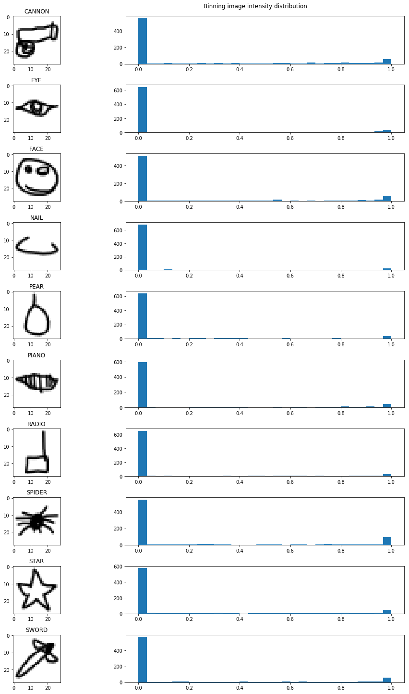
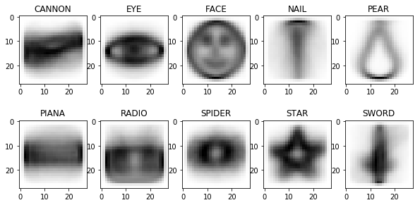
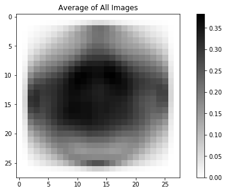

# Data Wrangling & Exploratory Data Analysis

[Jupyter Notebook](http://nbviewer.jupyter.org/github/nolanadams1230/Doodle_Classification/blob/master/notebooks/Data%20Wrangling%20%26%20Exploratory%20Analysis%20-%20Doodles.ipynb)

[Github](https://github.com/nolanadams1230/Doodle_Classification/blob/master/notebooks/Data%20Wrangling%20%26%20Exploratory%20Analysis%20-%20Doodles.ipynb)

# Overview

We go over the process of wrangling the data and the initial insights we obtain from exploring the images.

## Data
Google has capitalized on the use of crowdsourcing to label over 50 million drawings with their online game "Quick Draw!". It gives its users 20 seconds to draw one of 345 different classes that range from an aircraft carrier to a zig-zag. Recently, they have open-sourced all their data and I will select 10 images to build my classifier. The data we used is a 28x28 grayscale bitmap in numpy .npy format of the simplified version of each drawing. 
Other datasets we could have used include:
 - The raw dataset that contains a two letter country code of where the drawing originated, the drawing in a JSON array representing the vector drawing that details each stroke in the drawing and the timing it took to complete each stroke, whether the word was recognized by the game, the label, and the date/time of when the drawing was created.
 - A simplified version of the raw dataset that has timing information removed and has the drawings positioned and scaled into a 256x256 region.
 
The data wrangling process consisted of:
 - Loading each class separately into their own numpy array
 - Adding the class label to the array of each sample in the dataset.
 - The samples were then aggregated and split into training and testing sets.
 - The features were normalized between 0 and 1, as a means to "center" the data and have all pixels on the same scale. This weights all features equally in their representation.

## Initial Findings
We started our exploratory analysis by taking the first image in each classes’ dataset and plotting them along side a histogram of the pixel intensities. The histogram showed that each doodle’s pixels were mainly grouped at the two extreme of intensities with very few falling between.  Most pixels in the dataset are completely white, along with another set of pixels that are completely dark, with relatively few in between. If we wanted to, we could probably replace each pixel with a binary 0 or 1 with very little loss of information.
 
 
From there we plotted the average doodle for each class and the average doodle of all classes together. The average doodle for each class really highlighted where the important pixel will be for each class.

